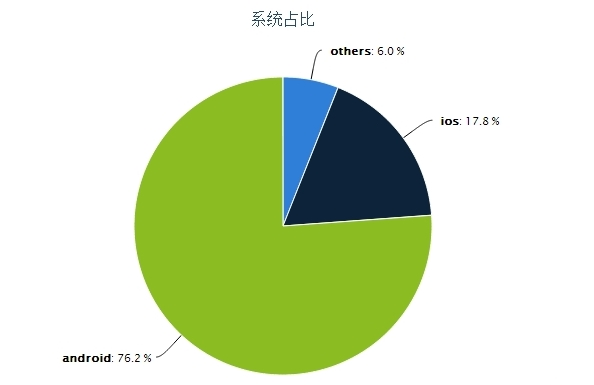
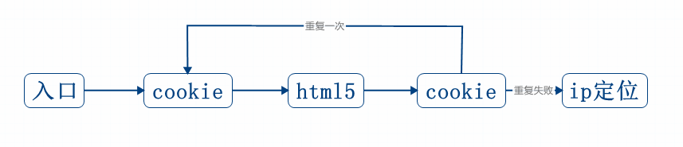

信息失败

---------
成功率的计算公式： 
---------
*  成功率 = （列表页收集到pv + 去其他城市）/ 点击量 × 100%
*  我们现在定位的成功率：86.75%

-----------
现在的定位流程：
------------

结论：
---
     1、目前定位成功率平均在60%左右。
          2、有28%的点击定位后拒绝共享位置，是否可以在定位开始前给予提示来引导用户，提高定位准确性和成功率。
          经过了这么多次改版，遇到的问题如下：
          ---
               1、部分三星、摩托以及部分国行手机无法定位成功，是因为缺少谷歌提供的GMS服务包导致定位失败。
                    2、IP定位是使用的百度IP定位功能，无法提供准确的街道信息。
                         3、网页上如果想直接获取手机gps定位信息，需要有本地服务来响应页面请求，网页无法开启本地服务进行监听来自页面的请求。

